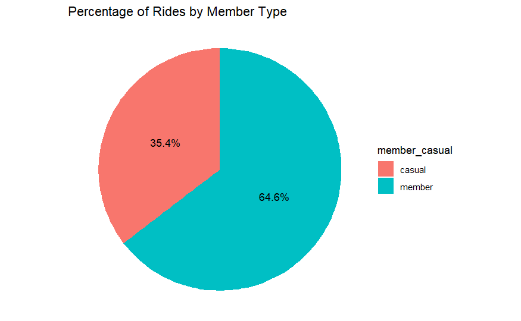

## Introduction

Welcome to the Cyclistic bike-share analysis case study! This is one of the case studies in the Google Data Analytics Course. In this case study, I work for a fictional company Cyclistic. I have decided to use R for this analysis.

## Scenario

Cyclistic is a bike-share company. The marketing director believes the company’s future success depends on maximizing the number of annual memberships. I want to understand how casual riders and annual members use Cyclistic bikes differently. This is one of the questions in the **Ask** phase assigned to me.

## [Data Preparation](01_data_preperation.R) 

I have used the previous 12 months of [Cyclistic’s historical trip data](https://divvy-tripdata.s3.amazonaws.com/index.html) (accessed on October 2024), which are in *.csv* file format. As a first step, I've combined all 12 months of data. In a code chunk I linked above, you can find how the data combination process is done. I have preferred to read and combine all the *.csv* files simultaneously using the *rbind()*.

## [Data Cleaning](02_data_cleaning.R)

After combining the data and getting the summary there were **5 699 639** rows and **13** variables. I wanted to ensure that there are no duplicate rows. I have deleted some columns that I was not planning to use. After checking the missing values, and empty strings I have deleted those rows too. Also, I have made changes to data types. Converted starting and ending time columns to date-time format, member type, and bike type columns to factor type for easier manipulation. 

I added columns that list the date, month, day, and year of each ride. This allowed me to aggregate ride data for each month, day, or year. 
Then, I added some aggregations to the data. First I did aggregations to see ride length and added **ride_length** column to the data. After sorting by **ride_length** I have found out some of them appear as negative values or zero. I deleted rows with negative values, as well as the rows that appear as zero, this is because employees took bikes out of circulation for quality Control reasons. 

I still had a lot of rows with a ride length of less than one minute, since we're analyzing rider behavior, especially to compare members and casual riders, rides shorter than 1 minute might not provide meaningful insight. Very short rides might skew summary statistics like average ride length. Removing them could give a more realistic picture of typical rides, especially when comparing the habits of casual riders and members.

## [Data Analysis](03_data_analysis_and_viz.R)

After I got clean and tidy data, I started my analysis. My task was to give the difference of how the members and casual users use Cyclistic bikes differently. In the code chunk linked above you can find codes for all visualizations and analysis processes. 

When I checked how many rides were taken by each member type for the last 12 months, 63.4% of the rides were made by members.

### Total Usage

**Total Ride Length:** Comparing the total ride length can show which group (members or casual riders) contributes more overall to the system's usage. Casual riders contribute almost the same percentage to total ride length, they could represent a valuable target for marketing efforts to convert them into members.

### Ride Duration Patterns

**Average Ride Length Comparison:** We can compare the average ride length between members and casual riders. Casual riders taking longer rides on average than members. This could indicate that casual riders use the service for leisure, while members may use it for commuting or shorter trips.

### Day of the Week Patterns

Are there significant differences in ride lengths on weekdays versus weekends for each group? Below is the visualization that shows us the difference between weekdays for each group. Casual riders prefer weekends while members use the service more on weekdays. This insight could suggest different user behaviors: casual riders might ride for leisure, while members use the service for work or daily activities.

We know that casual riders cycle longer if look at the average ride length. But if we look at the total ride length for each day of the week, we'll see how the rides are different on weekdays and weekends. Casual riders start to ride more than members starting Friday while whole weekday members cycle longer. 

### Time of Year:

**Seasonal Patterns:** 

Comparing ride data across months could reveal seasonal trends. Let's find out if there any significant changes in ride behavior in winter vs. summer? Does one group contribute more during particular seasons? 

Now let's have our visualizations comparing **ride data across months** in the previous 12 months (September 2023 - April 2024)

#### Ride Counts 

Members exhibit more consistent ride behavior throughout the year, although they still experience a significant seasonal dip during the winter. Casual riders heavily favor the summer months, with a sharp drop in usage during the colder months. Both groups experience their **lowest** ride counts in **January**, and their highest in **July and August**, aligning with warmer weather and possibly vacation times.

#### Average ride length

Average ride length peaks from **April to May**, showing that casual riders take longer rides during the spring months, likely due to favorable weather conditions and possibly more leisure activities. The lowest average ride length is during **November to January**, coinciding with colder weather when casual riders tend to ride less frequently and for shorter distances. The average ride length for members remains quite consistent across the year. 
Casual riders are more affected by seasonality in both ride counts and ride length, with longer rides in the spring and significantly shorter rides during the winter. Members maintain a more stable usage pattern and ride length throughout the year, reflecting more consistent service usage, likely for commuting or regular transportation purposes. The biggest difference between the two groups lies in the ride length variability: casual riders have large fluctuations in ride length depending on the season, while members’ ride lengths are relatively stable.

#### Total ride length

**Casual Riders:**

Peak total ride length for casual riders is during the summer months, from June to August. During this period, they tend to take longer rides compared to members. The largest difference in total ride length between members and casual riders occurs during these summer months, where casual riders significantly outpace members in terms of how long they cycle in total. Casual riders’ total ride length drops off sharply in September, continuing to decline through the colder months.

**Members:**

Members have a more consistent total ride length throughout the seasons, with their peak period being slightly longer, from June to September. During the winter and spring months (October to April), members consistently record a higher total ride length compared to casual riders, suggesting more year-round, committed usage. While casual riders surpass members in total ride length during the summer, members generally cycle more during the other months of the year.

**Closest Total Ride Length Months:**

The closest months in terms of total ride length between the two groups are March, April. During these transition months, casual riders begin ramping up their activity, while members maintain a steady usage, leading to a smaller gap between the two groups.

## Summary

### Casual Riders:

* Casual riders take approximately 1.8 times fewer rides than members, but their average ride length is about 2 times longer. Their total ride length throughout the year is similar to members.

* There is a significant gap in ride counts between weekdays and weekends, with casual riders taking fewer rides on weekdays. However, on weekends, they accumulate more total ride length than members.

* During weekdays, their total ride length is generally less than that of members, but Fridays show the closest balance between the two groups.

* Average ride length is higher than that of members but decreases from October, reaching a low in winter months, before increasing again in spring, peaking between May and July.

* Total ride length for casual riders is lower than members from October to April, but they experience a peak from June to August, where they exceed members, particularly in summer.

### Members:

* Members take more frequent but shorter rides compared to casual riders.

* Although their average ride length is about 2x shorter, their total ride length throughout the year is very close to casual riders.

* Members are more active on weekdays, with the number of rides decreasing slightly from Friday through the weekend.

* Their total ride length is consistent across weekdays, reflecting regular commuting or daily use.

* Members have a consistent average ride length throughout the year, with minor fluctuations.

* During the winter months (October to April), their total ride length is higher than casual riders, but during the peak months (June to September), casual riders surpass them in total ride length.

## Act

* If casual riders are taking frequent long rides, on weekends and in warmer months this might be an opportunity to offer them membership plans tailored to their needs, potentially converting them into members.

* Since casual riders are more active on weekends, offering weekend-only membership options could appeal to them. This could provide the convenience of unlimited rides on Saturdays and Sundays at a lower cost compared to a full membership.

* Casual riders tend to ride more during warmer months (spring and summer), so offering seasonal memberships for these months could be tempting. This would allow them to benefit from membership perks without committing to a full year.

* Casual riders have longer average ride lengths, so we could design membership tiers based on ride duration. For example, a plan that includes longer rides at a discounted rate might encourage them to become members.

